# Pybalmorel for map plotting

This notebook provide examples on how to use the pybalmorel post processing map plotting tool. 

```python
### Loading scenarios
res = MainResults(files=['MainResults_Example1.gdx', 'MainResults_Example2.gdx', 'MainResults_Example3.gdx'], paths='files', scenario_names=['SC1', 'SC2', 'SC3'])
```

## Basic map plotting

The map plotting tool only needs 3 arguments to work. One has to select the **scenario** (see scenarios importation in [this section](postprocessing.md)), the **year** and the **commodity** shown on both the lines and the generation capacity. \
For now, electricity and hydrogen can be selected as commodities. If the information are available in the gdx results file, it should work.


```python
fig, ax = res.plot_map(scenario='SC3', year=2050, commodity='Electricity')
```
    
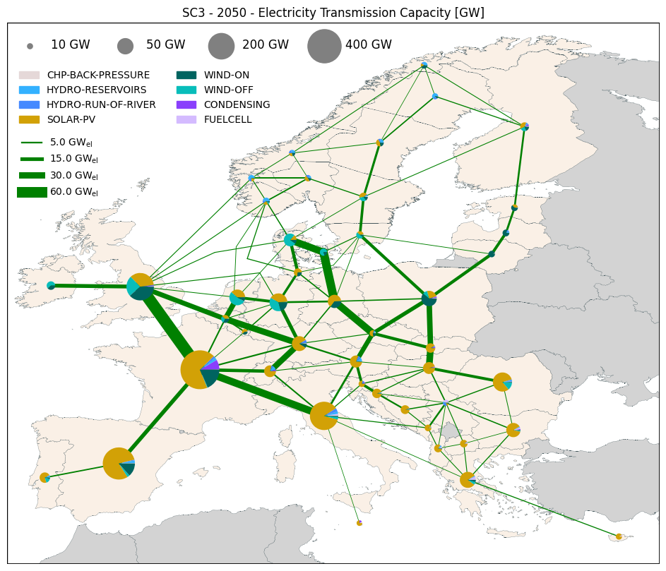
    

```python
fig, ax = res.plot_map(scenario='SC3', year=2050, commodity='Hydrogen')
```
   
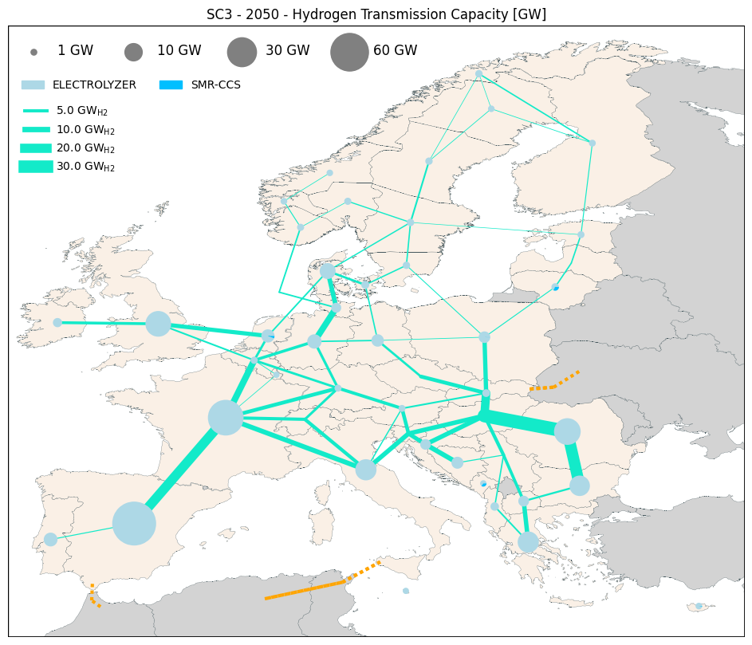


## Selecting a different transmission information

The option **lines** allows to plot different transmission line information amongst *Capacity*, *FlowYear*, *FlowTime*, *UtilizationYear*, *UtilizationTime*. \
Please note that for *FlowTime* and *UtilizationTime*, it is possible to select a specific **S** and **T** to select a specific simulation time. \
It is also possible to select with **generation** the generation information plotted amongst *Capacity* and *Production*. It is also possible to desactivate pie charts with *generation_show* option.


```python
fig, ax = res.plot_map(scenario='SC3', year=2050, commodity='Electricity', lines='Capacity', generation='Capacity')
```


```python
fig, ax = res.plot_map(scenario='SC3', year=2050, commodity='Electricity', lines='FlowTime', generation='Production', S='S08', T='T076')
```
    
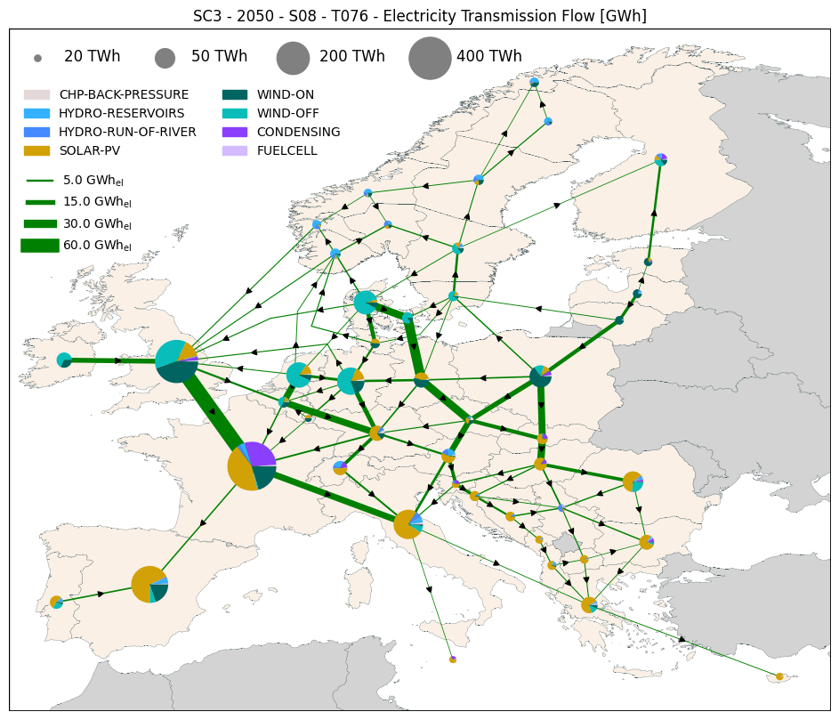
    

```python
fig, ax = res.plot_map(scenario='SC3', year=2050, commodity='Electricity', lines='FlowYear', generation='Production', generation_show=False)
```

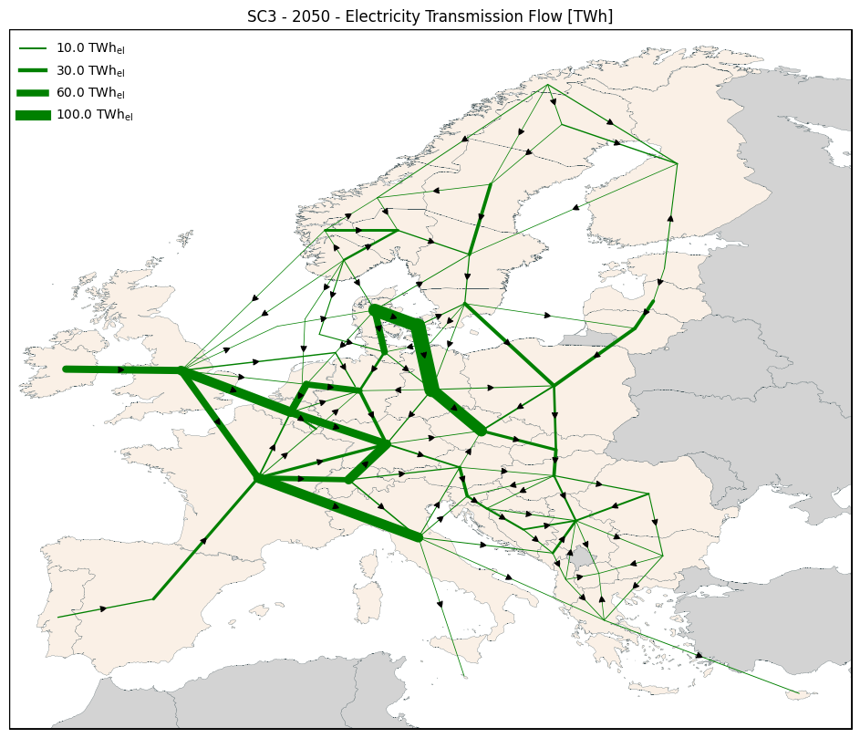
    

```python
fig, ax = res.plot_map(scenario='SC3', year=2050, commodity='Electricity', lines='UtilizationTime', generation='Production')
```
    
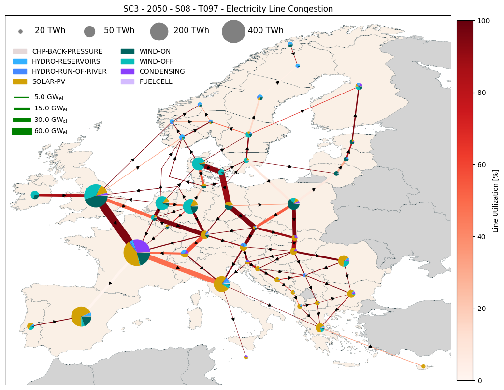
    

```python
fig, ax = res.plot_map(scenario='SC3', year=2050, commodity='Electricity', lines='UtilizationYear', generation='Production')
```
    
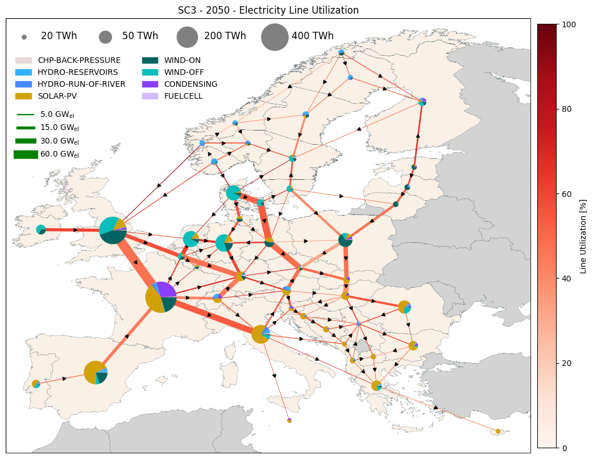
    


## Background information and legend selection

Using the option **background**, it is possible to plot an additional information that colors the countries. For now *H2 Storage* and *Elec Storage* have been implemented. \
It is also possible to change the legend of the pie charts and to select either *TECH_TYPE* or *FFF* to be plotted.


```python
fig, ax = res.plot_map(scenario='SC3', year=2050, commodity='Electricity', lines='FlowYear', generation='Capacity', background="Elec Storage", generation_var='TECH_TYPE')
```
 
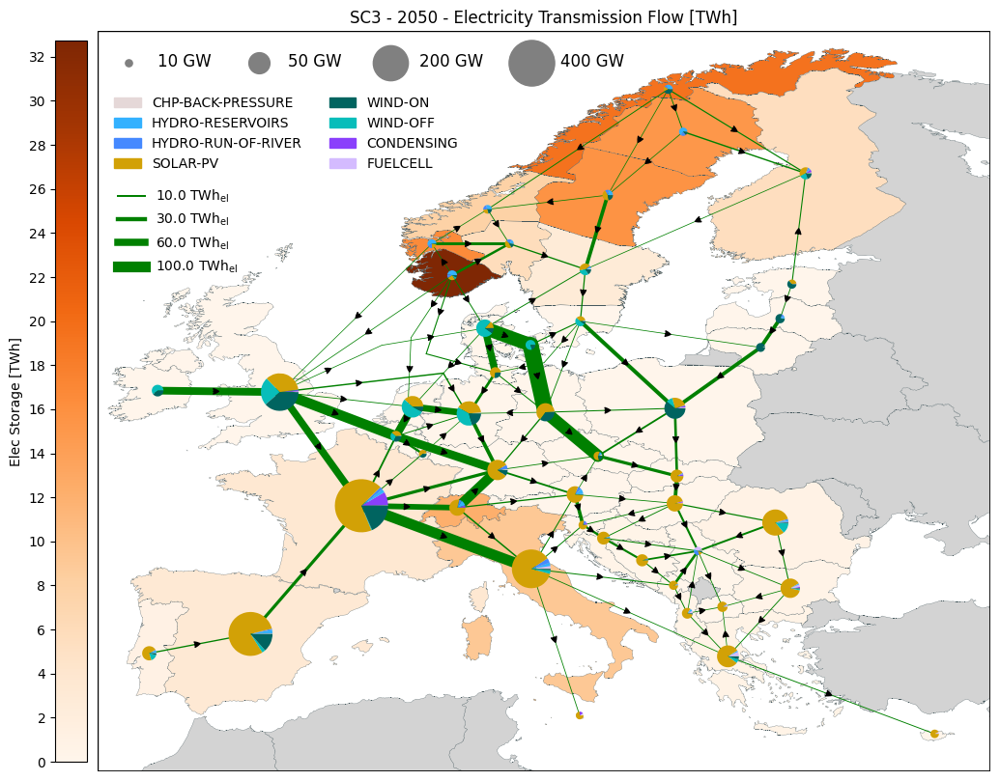
    

```python
fig, ax = res.plot_map(scenario='SC3', year=2050, commodity='Electricity', lines='FlowYear', generation='Capacity', background="H2 Storage", generation_var='FFF')
```
    
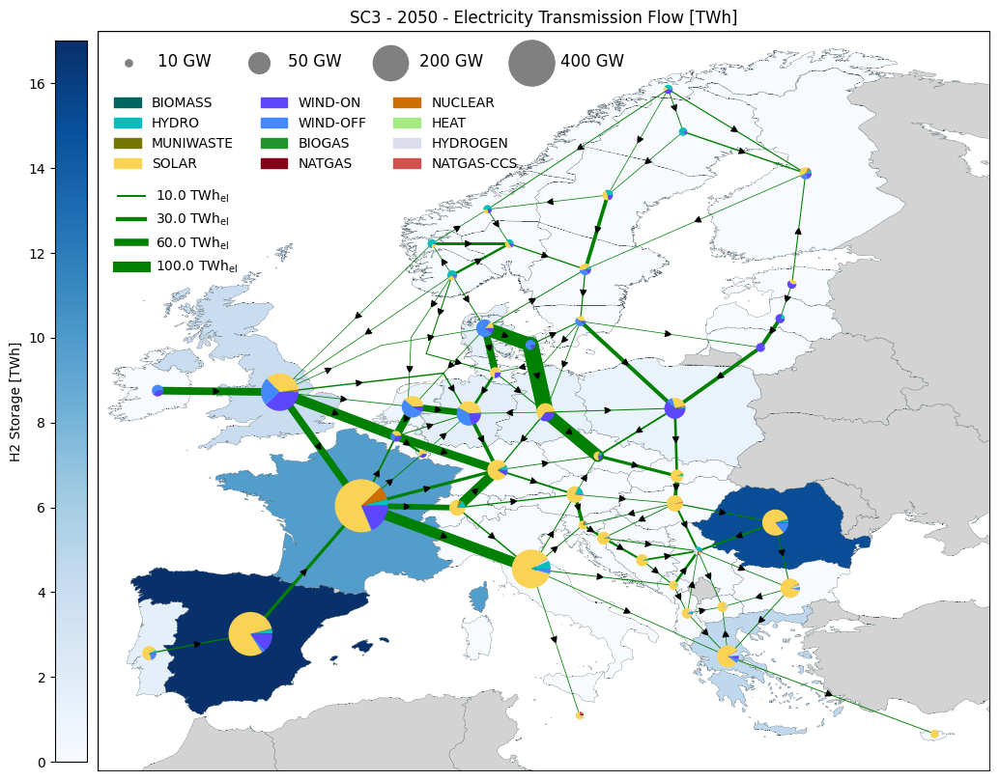
    

## Geofile input and coordinates issues

Using the option **path_to_geofile**, it is possible to use a personalized map file with a specific column (option *geo_file_region_column*) with the name of the regions in your Balmorel file. \
When using this option, the coordinates are set automatically as the border of the map plus an offset that can be modified with the option *coordinates_geofile_offset*. \
It is also possible to choose to plot only Denmark by setting *choosen_map_coordinates* as "DK" (if you only have data for denmark, please use it) or to select specific coordinates with *map_coordinates*. \
Please note that when modifying all of this, you will have trouble with the size of the pie charts that are defined in data values. You will need to modify those to have something that you like. \
**For now, the legend is only working for the EU coordinates (in the case of having data for all EU) !!**


```python
fig, ax = res.plot_map(scenario='SC3', year=2050, commodity='Electricity', path_to_geofile="../../../examples/files/Geofile_Example.geojson")
```
    
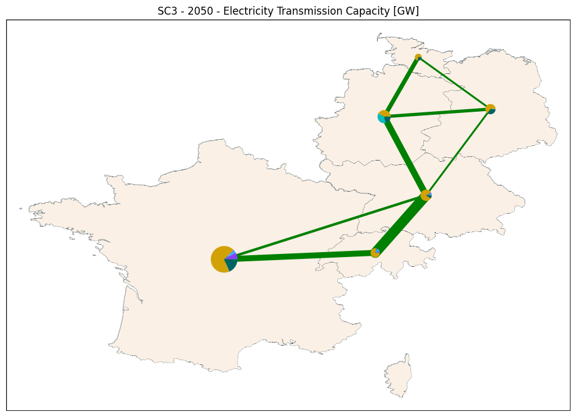
    

```python
fig, ax = res.plot_map(scenario='SC1', year=2050, commodity='Electricity', lines='Capacity')
```

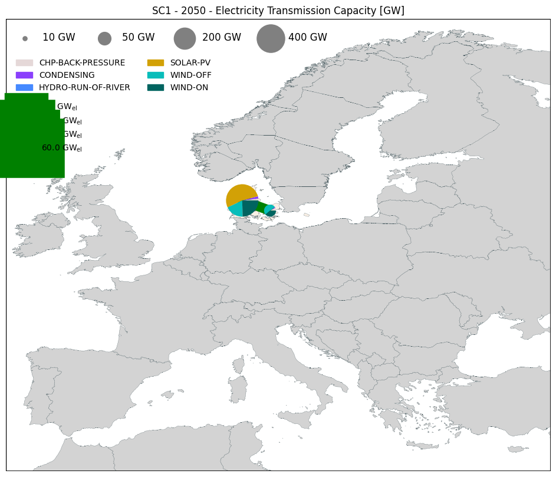
    

```python
fig, ax = res.plot_map(scenario='SC1', year=2050, commodity='Electricity', lines='Capacity', choosen_map_coordinates="DK")
```

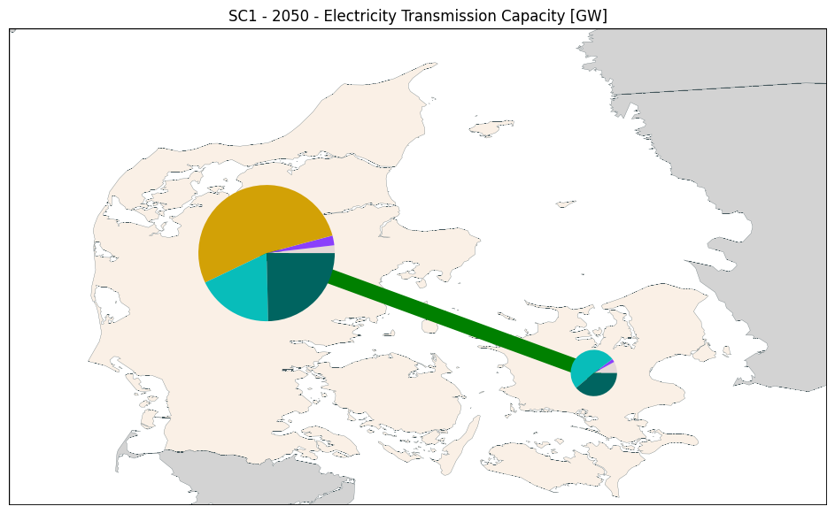
    


## Additional options

There is a large number of additional options available and the detailed can be found in the function's help below :


```python
help(res.plot_map)
```

Let's review some examnples :

```python
# If you want to show the value of the lines and not the arrows
fig, ax = res.plot_map(scenario='SC3', year=2050, commodity='Electricity', lines='UtilizationYear', generation='Capacity',
                       line_label_show=True, line_flow_show=False)
```
    
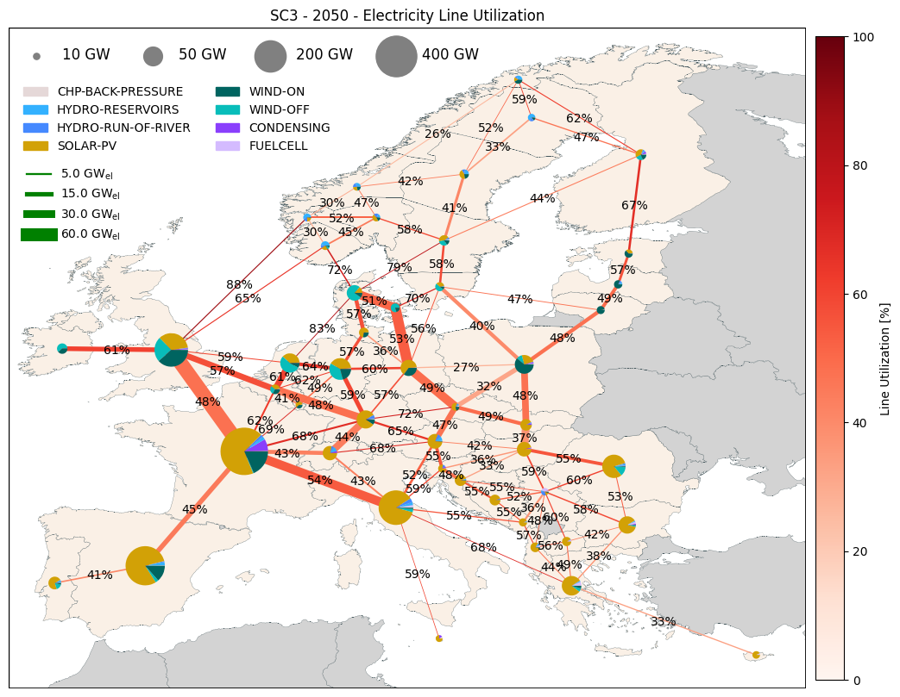
    

```python
# If you want to clusterize the pie charts and/or the lines and not plot the smaller ones
fig, ax = res.plot_map(scenario='SC3', year=2050, commodity='Electricity', lines='FlowYear', generation='Capacity',
                       line_width_cat='cluster', pie_radius_cat='cluster', line_show_min=1)
```
    
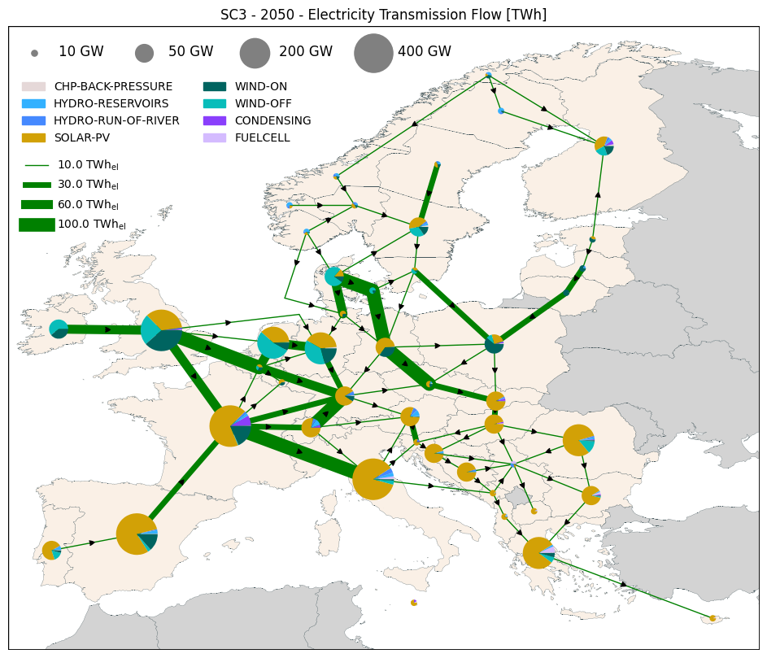
    

```python
# If you want to specified the colors of things
fig, ax = res.plot_map(scenario='SC3', year=2050, commodity='Electricity', lines='FlowYear', generation='Capacity',
                       background_color='blue', regions_model_color='green', regions_ext_color='red', line_color='black')
```
    
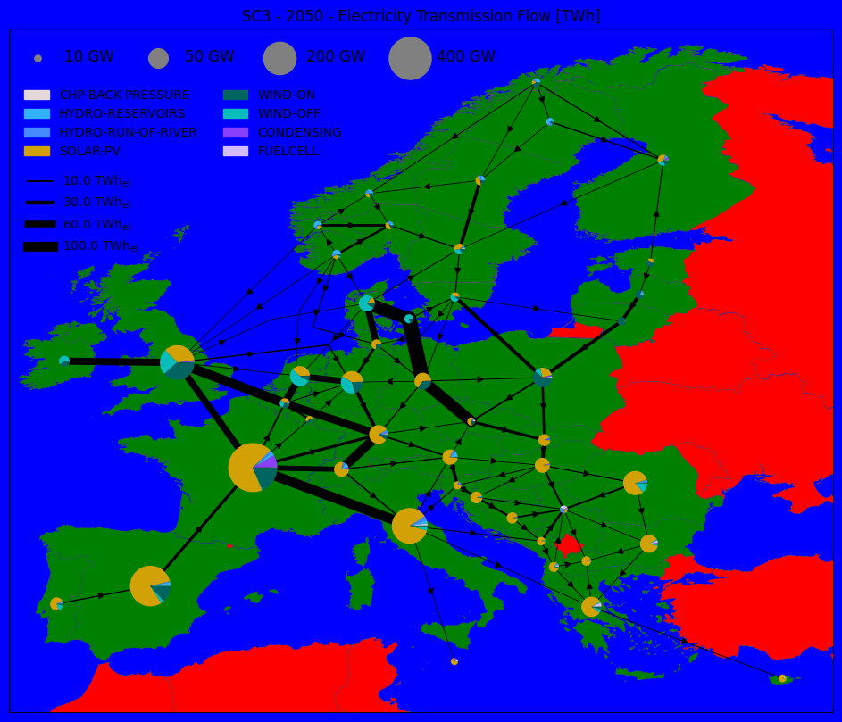
    

